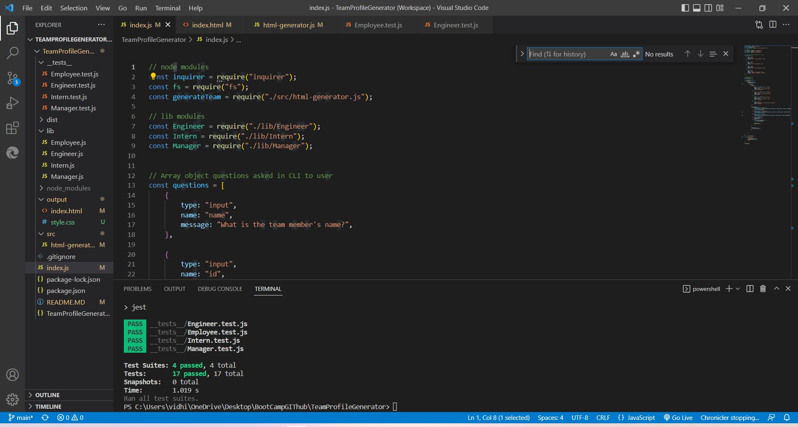
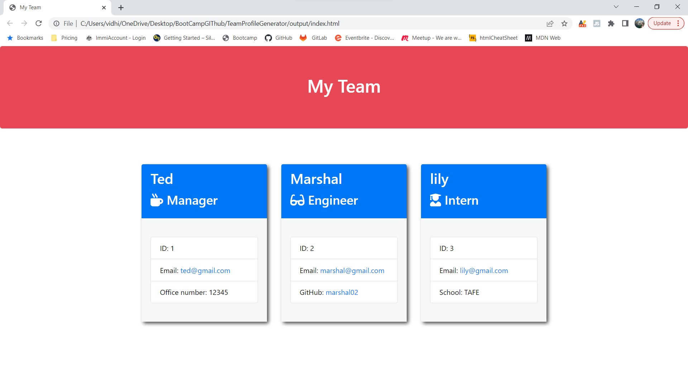

## Overview

As a manager, I want to be able to dynamically and quickly create an HTML file with employees' information using answers
provided from Inquirer NPM.

## Table of Contents

- [Description](#description)
- [Installation](#installation)
- [Usage](#usage)
- [Test](#test)
- [Deployed](#deployed)
- [Tools](#tools)
- [Research](#research)
- [Questions](#questions)

## Description

To dynamically and quickly create a team HTML page, Inquirer NPM was utilized to:

- Generate command-line questions to the user.
- The user input was gathered and added as information to employee templates to create HTML pages.

## Installation

1. Create a .gitignore file and include node_modules? and .DS store. This ensures that the node_modules directory isn't
   tracked or uploaded to GitHub.
2. Use the command-line, npm install, to install Inquirer NPM.
3. To start answering questions to create the HTML file, use the command, node app.js.

## Usage

- Inquirer NPM is used to prompt the user to provide information regarding their employee teams to create their HTML
  pages.
- fs.writeFile is used to render the HTML.
- Once the user's information regarding:
  - name, id, email, member's role, then subsequent user role questions are served:
  - Manager - office, Engineer - Github Username, and Intern - school name.
- An HTML file with the user's reponses regarding their team is created.

## Test

## Deployed

- \*[Demo Video](https://www.youtube.com/watch?v=vnGwlb26SGQ)
- \*[Deployed website]()
- \*[GitHub Repository](https://github.com/Vidhi0307/TeamProfileGenerator)

### Screenshot of rendered HTML page 

## Tools

- JavaScript
- Inquirer NPM
- .gitignore
- Git Bash

## Research

- [Inquirer.js - NPM](https://www.npmjs.com/package/inquirer)

## Questions

- [Email](vidhi.sydney07@gmail.com)
- [GitHub Profile](https://github.com/Vidhi0307/)
- [GitHub Repository](https://github.com/Vidhi0307/TeamProfileGenerator)

